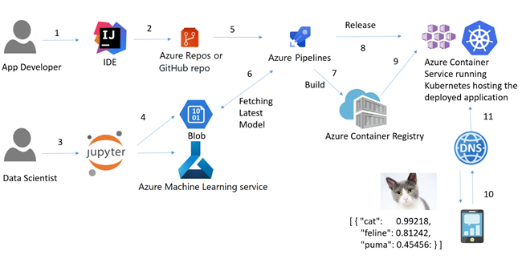
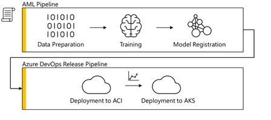
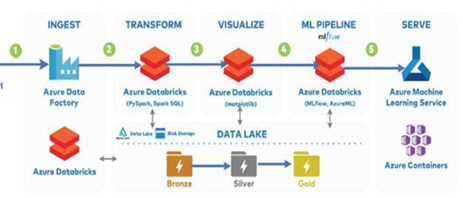
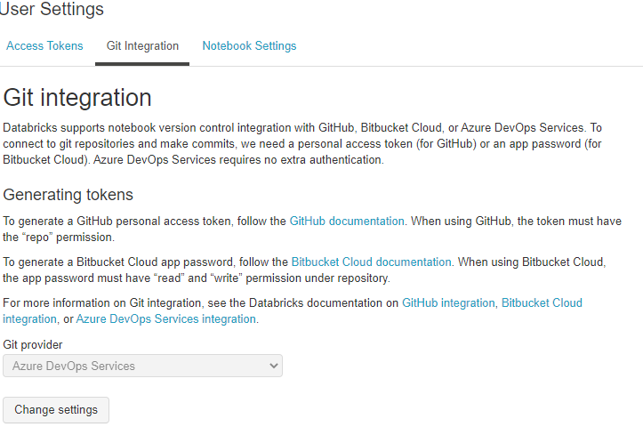
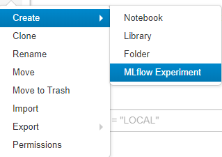
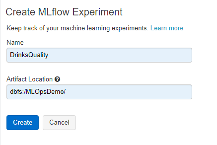
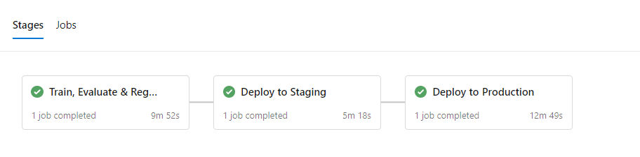

[](https://dev.azure.com/ahmosta/MLOpsDatabricks/_build/latest?definitionId=1&branchName=master)

# Large-scale Data/MLOps with Azure & Databricks
## How to implement DataOps/MLOps using Azure Devops, Databricks, MLFlow, Azure ML

Operationalizing Data Analytics and Machine Learning workloads can be challenging; because the ecosystem of platforms and services involved used to build such workloads is big; which increases the complexity of deploying such workloads to production. The complexity also increases with the continous adoption of running in containers and using container orchestration frameworks such as Kubernetes.

This repo demonstrates an approach of implementing DevOps pipelines for large-scale Data Analytics and Machine Learning (also called Data/MLOps) using a combination of [Azure Databricks](https://azure.microsoft.com/en-us/services/databricks/), [MLFlow](http://mlflow.org), and [AzureML](https://azure.microsoft.com/en-us/services/machine-learning/).

The DevOps pipeline is implemented in [Azure DevOps](https://azure.microsoft.com/en-us/services/devops/), and it deploys the workload in a containerized form simulating staging & production environments to [Azure Container Services](https://azure.microsoft.com/en-us/product-categories/containers/) and [Azure Kubernetes Services](https://azure.microsoft.com/en-us/services/kubernetes-service/).

The diagram below shows a high-level overview of a generic DevOps process;  that build pipelines build the project's artifacts followed by a testing & release process. The DevOps pipeline deploys the built artifacts in one or more environments. This process can be automated to speed up development of projects (as well as of analytics & ML workloads). 

   

This tutorial will walk you through how to implement ML Ops in the following general form:

   

Such MLOps pipelines can apply to practically any big-data & analytics workload; not just machine learning modeling. This tutorial however will focus on building such Azure DevOps pipelines with specific integration to Azure Databricks.

   

This tutorial demos also how Databricks notebooks leverage both MLFlow as well as Azure ML SDK to publish the workloads to the container registry and deploy it afterwards to Azure Container Instances and Azure Kubernetes Services.

## Using This Sample Project

This repo is configured to run and use Azure DevOps, therefore you need to prepare you enviroment with the following steps.

The DevOps Pipeline is a "multi-staged" pipeline and it is defined using the YAML file [azure-pipelines.yml](./azure-pipelines.yml) for Azure DevOps. 

> Note: Building Github workflow actions is in progress as well.

## Required Accounts And Resources

This example uses Azure DevOps as an CI/CD toolset, as well as Microsoft Azure services to host the trained Machine Learning Model.

* At the time of creating this tutorial, GitHub Actions were still beta. If you wan't to try this new feature, you have to [Sign up for the beta](https://github.com/features/actions) first.

### Azure Databricks Workspace

In your Azure subsciption, you need to [create an Azure Databricks workspace](https://docs.azuredatabricks.net/getting-started/try-databricks.html#step-2-create-a-databricks-workspace) to get started.

> NOTE: I recommend to place the Azure Databricks Workspace in a new Resource Group, to be able to clean everything up more easily afterwards.

## Importing This DevOps Project

As soon as you have access to the Azure DevOps platform, you're able to [create a project](https://docs.microsoft.com/en-us/azure/devops/user-guide/sign-up-invite-teammates?view=azure-devops#create-a-project) to host your MLOps pipeline.

As soon as this is created, you can [import this GitHub repository](https://docs.microsoft.com/en-us/azure/devops/repos/git/import-git-repository?view=azure-devops) into your Azure DevOps project.

### Connecting Azure Databricks Notebooks to the Azure DevOps *Repo*

It is recommended to connect your notebooks to the Azure DevOps repo. This will ensure your changes & updates are pushed to the repo automatically and gets built properly. The pipeline is automatically triggered by any commit/push to the repo.

To configure this, go to the "User Settings" and click on "Git Integration". 

### Create MLFlow Experiment
The Databricks notebooks use MLFlow under the hoods; in order to create the MLFlow experiment you need to do this after importing the notebooks in the Databricks workspace.



Clicking on the above link will open a screen where you can specify the name of the experiment and its location on DBFS. For this demo, make sure the MLFlow experiment's name is DrinksQuality.




## Set up The Build Pipeline

By importing the GitHub files, you also imported the [azure-pipelines.yml](./azure-pipelines.yml) file.

This file can be used to create your first Build Pipeline.

This Build Pipeline is using a feature called "[Multi-Stage Pipelines](https://docs.microsoft.com/en-us/azure/devops/pipelines/process/stages?view=azure-devops&tabs=yaml)". This feature might not be enabled for you, so in order to use it, you should [enable this preview feature](https://docs.microsoft.com/en-us/azure/devops/project/navigation/preview-features?view=azure-devops).



## Connecting Azure Databricks

### Connecting the Azure DevOps *pipeline* to Azure Databricks

To be able to run this pipeline, you also need to connect your Azure Databricks Workspace with the pipeline.

Therefore, yor first need to [generate an access token on Databricks](https://docs.azuredatabricks.net/dev-tools/api/latest/authentication.html#generate-a-token).

This token must be stored as encrypted secret in your Azure DevOps Build Pipeline...


> NOTE: The variable must be called *databricks.token* as it is referenced within the pipeline YAML file.
> NOTE: There are additional variables that need to be defined to ease the build & deployment operation. You're free to decide if those variables should be defined as secrets or text values.


... or your GitHub Project.


> NOTE: The GitHub Secret must be called *DATABRICKS_TOKEN*


## Connecting the Azure ML Service Workspace

### Step 1: Create Azure AD Service Principal

The Databricks-Notebooks will be used also for serving your model, by leveraging and creating an Azure Machine Learning Workspace (and other resources) for you.

Azure Databricks Service requires access rights to do that, therefore you need to create a Service Principal in your Azure Active Directory.

You can do that directly in the [Cloud Shell](https://docs.microsoft.com/en-us/azure/cloud-shell/overview) of the Azure Portal, by using one these two commands:

``` bash
az ad sp create-for-rbac -n "http://MLOps-Databricks"
```

> Least Privilege Principle: If you want to narrow that down to a specific Resource Group and Azure Role, use the following command

``` bash
az ad sp create-for-rbac -n "http://MLOps-Databricks" --role contributor --scopes /subscriptions/{SubID}/resourceGroups/{ResourceGroup1}
```

> Make a note of the result of this command, as you will need it in a later step.

### Step 2: Install / Update Databricks CLI

Azure Databricks has its own place to store secrets.

At the time of creating this example, this store can be only accessed via the Databricks command-line interface (CLI).

Although not required, but you can install this CLI on your local machine or in the Azure Cloud Shell.

``` bash
pip install -U databricks-cli
```

> NOTE: You need python 2.7.9 or later / 3.6 or later to install and use the Databricks command-line interface (CLI) 

### Step 3 (optional): Store Databricks Secrets

Using the Databricks CLI, you can now create your own section (scope) for your secrets...

``` bash
databricks secrets create-scope --scope azureml
```

... and add the required secrets to the scope.

``` bash
# Use the "tenant" property from the Azure AD Service Principal command output
databricks secrets put --scope azureml --key tenant_id
# Use the "appId" property from the Azure AD Service Principal command output
databricks secrets put --scope azureml --key client_id
# Use the "password" property from the Azure AD Service Principal command output
databricks secrets put --scope azureml --key client_secret

databricks secrets put --scope azureml --key subscription_id
databricks secrets put --scope azureml --key resource_group
databricks secrets put --scope azureml --key workspace_name
```
> NOTE: The Azure DevOps Pipeline installs and defines these secrets automatically. Databricks Secrets Scopes can be passed as parameters to give flexibility to the Notebook using secrets between environments. 

## OPTIONAL: Pre-Approval Checks (Azure DevOps)

To avoid high costs from the Azure Kubernetes Service, which will be created by the "Deploy To Production" stage, I recommend that you [set up a Pre-Approval Check](https://docs.microsoft.com/en-us/azure/devops/pipelines/process/approvals?view=azure-devops) for the drinks-quality-production environment.

This can be done in the Environments section of your Azure Pipelines.


## Issues & Take aways & TO DOs:

- Notebooks should be configured to pull variables from Databricks Secrets
- Notebooks secrets values should be defined in separate Secrets Scopes.
  - Secret Scopes can be set to the same variable, is updated using Databricks CLI, from the Azure DevOps pipeline.
- Manage AzureML workspace & Environments from within Azure DevOps pipeline instead of the Python SDK (within Databricks notebooks).
- Use Databricks automated clusters (job clusters) instead of Interactive clusters.
- Multi-Stage pipelines are very nice; but they might become harder to maintain. Think about separating your pipelines and connecting them together.

_Disclaimer:_ This work is inspired by and based on efforts done by Sascha Dittman.
